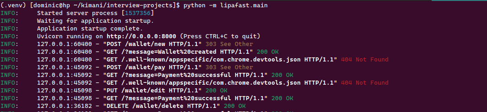
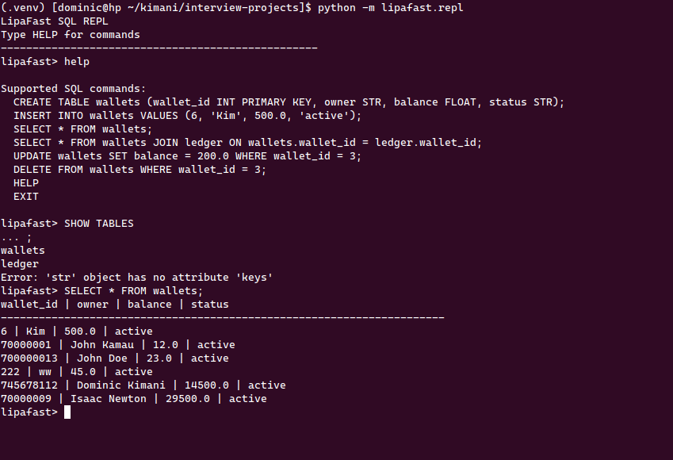
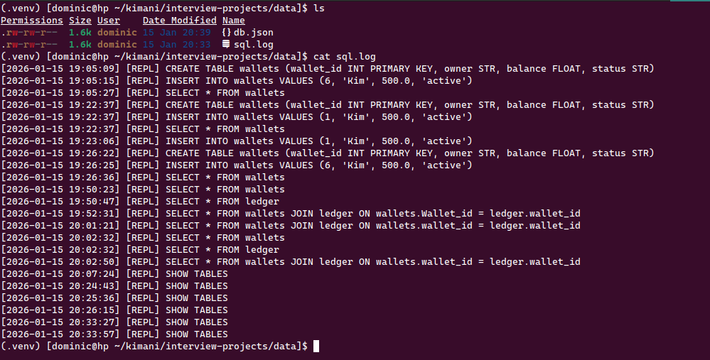

# LipaFast – Minimal Python RDBMS for Fleet Fuel Management

**A lightweight in memory relational database system in Python, powering a driver wallet system for fleet fuel management.**

LipaFast combines a **custom SQL database engine** with a **REST API and interactive REPL**, enabling **real-time wallet management, transaction logging, and auditing**.

 

## Key Features

* **Custom SQL Parser** supporting:

  * `CREATE TABLE`, `INSERT`, `SELECT`, `JOIN`, `UPDATE`, `DELETE`, `SHOW TABLES`
* **Interactive REPL** for experimenting with SQL queries
* **FastAPI Server** exposing REST endpoints
* **Persistent JSON storage** (`data/db.json`) shared between REPL and API
* **SQL logging** to track all executed commands
* **ACID-like behavior**: atomic operations, primary/unique key constraints, consistent state across API and REPL

 

## Problem Statement

Managing fuel payments for logistics fleets is challenging:

* Managers face delays sending funds to drivers on the move
* Drivers must wait for M-PESA transfers before fueling
* Hard to track fuel usage patterns in real-time
* Fraud such as duplicate purchases is difficult to detect
* Manual reconciliation with receipts is error-prone

**LipaFast provides a simple, auditable, and real-time solution.**

 

## System Overview

### **1. Database Engine**

* In-memory relational tables with persistent JSON storage
* Primary and unique key indexing for fast lookups
* Join support for cross-table queries
* SQL logging for auditability

**Tables:**

```sql
-- Driver wallets
CREATE TABLE wallets (
    wallet_id INT PRIMARY KEY,
    owner STR,
    phone STR UNIQUE,
    balance FLOAT,
    status STR,         -- active/frozen/closed
    created_at STR
);

-- Transaction ledger
CREATE TABLE ledger (
    transaction_id INT PRIMARY KEY,
    wallet_id INT,
    amount FLOAT,
    direction STR,      -- debit/credit
    timestamp STR       -- audit trail
);
```

 

### **2. REST API & Wallet System**

* Create, update, and monitor driver wallets
* Instant fuel payments with real-time balance deduction
* Immutable transaction ledger for auditing
* Supports top-ups, balance updates, and deactivations

**Endpoints:**

```python
# Create wallet
GET /  # Displays a dashboard with all wallets and transactions

POST /wallet/new
{
    "wallet_id": 70000001,
    "owner": "John Kamau",
    "phone": "0712345678",
    "balance": 25000
}

# Make a payment
POST /wallet/pay
{
    "wallet_id": 70000001,
    "amount": 3500
}

# Top-up wallet
DELETE /wallet/delete
{
    "wallet_id": 70000001,
}
```

 

### **3. Interactive SQL REPL**

* Execute SQL commands without API
* Persistent storage ensures changes reflect in API and vice versa

**Examples:**

```sql
-- Insert wallet
INSERT INTO wallets VALUES (70000002, 'Alex Doe', '0722334455', 10000, 'active');

-- View all wallets
SELECT * FROM wallets;

-- Join wallet with ledger
SELECT * FROM wallets JOIN ledger ON wallets.wallet_id = ledger.wallet_id;

-- Update balance
UPDATE wallets SET balance = 20000 WHERE wallet_id = 70000001;

-- Delete wallet
DELETE FROM wallets WHERE wallet_id = 70000002;

-- Show all tables
SHOW TABLES;
```

 

## 🚀 Getting Started

```bash
# 1. Clone and setup
mkdir my-project && cd my-project

git clone https://github.com/Kimani-Dominic/Lipafast.git

cd lipafast

# 2. Setup virtual environment
python -m venv .venv

source .venv/bin/activate      # Linux/Mac
# .venv\Scripts\activate       # Windows


# 3. Install dependencies
pip install -r requirements.txt

#4. Change directory back to my-project directory
cd ..

# 4. Run what you need:
python -m lipafast.repl      # SQL REPL (command line)

python -m lipafast.main        # Web server (http://0.0.0.0:8000)
```

## Technical Highlights

* Lightweight, **Python-based RDBMS**
* **ACID-inspired features**: primary/unique constraints, atomic operations, consistent state
* SQL parser and REPL implementation from scratch
* FastAPI integration for web services
* Persistent JSON storage ensures **data durability**
* SQL logging for **auditability and debugging**

## Screenshots


 



